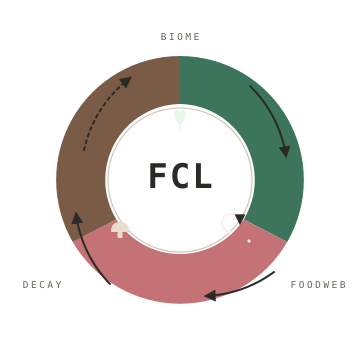

# FCL — 食物链语言 (FoodChain Language)

<p align="center">
  
</p>

> **代码在吞噬中传递，真理在分解中显现。**
> 一门把生态学写进语法的深奥编程语言（Esolang）。变量是生态圈的在册物种，运算是一次次捕食，控制流是一场场生态演替。参考实现为 C++17 解释器。

[](https://github.com/Huang-520-add/fcl/actions)


[](https://huang-520-add.github.io/fcl/)
[](#-文档与教程)

## 它是什么？

FCL 是一门专为生物学爱好者和编程初学者设计的深奥编程语言。程序强制按生态结构组织：

```
BIOME { ... }    ← 引种段：声明物种（变量）并注入初始能量
FOODWEB { ... }  ← 捕食段：核心运算逻辑（必须至少一次啃食）
DECAY { ... }    ← 分解段：输出与内存回收
```

- **变量 = 生态圈在册物种**：10 个代表物种，5 个营养级（详见 [生态圈图鉴](docs/FCL_ECOLOGY.md)）
- **族群结构**：独居（虎/狐/兔）用编号；群居（狼/狮/羊）有首领（`Alpha_Wolf` 狼王）和带性别标签的成员（`Wolf_M1` 雄性1号、`Sheep_F2` 雌性2号）
- 运算 = 捕食：`捕食者 DEVOURS 猎物 USING 算法`，**营养级必须恰好差 1**
- 每次捕食仅 **20% 能量**流向捕食者（林德曼定律的传递效率，其余 80% 散失）
- 没有 `if` / `for`，只有 `SEASON`（雨季/旱季）、`MIGRATION`（迁徙）、`HIBERNATION`（冬眠）、`MUTATION`（变异）
- 分解者只分解"尸体"（能量耗尽的变量）；活体（能量>0）不受分解威胁
- **图灵完备**：ASSESS（比较）+ HIBERNATION（条件循环）+ INTRODUCE（无限存储）

## 快速开始

**方式一：在线试玩**（无需安装）→ [FCL Playground](https://huang-520-add.github.io/fcl/)

**方式二：下载预编译二进制** → [Releases](https://github.com/Huang-520-add/fcl/releases)（Linux / Windows / macOS，Windows 版静态链接免运行时）

**方式三：源码编译**

```bash
make build            # 编译（g++ -std=c++17 -O2）
./fcl examples/example3.fc   # 输出: AU+0041（--real 真实模式带 🧬 标识: 🧬A🧬U+0041）
make test             # 全量 43 用例 + 25 条输出断言测试
```

```foodchain
GMO ENABLED ;
BIOME {
INTRODUCE Grass_1 AS PRODUCER WITH 60+5 ;
INTRODUCE Sheep_M1 AS HERBIVORE WITH 0 ;
}
FOODWEB {
Sheep_M1 DEVOURS Grass_1 USING SUM ;
}
DECAY {
INTRODUCE Fungus_1 AS DECOMPOSER WITH 0 ;
Fungus_1 DEVOURS Sheep_M1 USING SUM ;
ROT Fungus_1 TO STDOUT ;
ROT Fungus_1 TO STDOUT ;
}
```

## 语言特性速览

| 特性 | 语法 | 生态隐喻 |
|---|---|---|
| 声明变量 | `INTRODUCE 物种 AS 营养级 WITH 表达式 ;` | 引种 |
| 加法 | `A DEVOURS B USING SUM ;` | 捕食（合并能量） |
| 减法 | `A DEVOURS B USING DIFF ;` | 大欺小 |
| 乘除 | `A DEVOURS B USING PROD/QUOT ;` | 仅 APEX 可用 |
| 复制 | `CLONE 目标 FROM 源 ;` | 无性繁殖（克隆） |
| 比较 | `ASSESS A AGAINST B TO C ;` | 生态位评估（优势种判定） |
| 逻辑与 | `SYMBIOSIS A WITH B TO C ;` | 互利共生 |
| 逻辑或 | `COMPETITION A OR B TO C ;` | 替代觅食路径 |
| 逻辑非 | `MIMICRY A TO B ;` | 拟态伪装 |
| 输入 | `SCENT/LURK/POUNCE 组合` | 嗅探→潜伏→猛扑捕获 |
| 输出 | `ROT 分解者 TO STDOUT ;` | 分解矿化 |
| 分支 | `SEASON RAIN { } DRY { }` | 雨季/旱季（湿度驱动） |
| 定次循环 | `MIGRATION 物种 OVER n { }` | 迁徙（能量开方衰减） |
| 条件循环 | `HIBERNATION 物种 UNTIL C { }` | 冬眠（直到春天才醒） |
| 多路选择 | `MUTATION 物种 { CASE "特征": }` | 基因变异（触发时随机表达一支） |
| 手动回收 | `EXTINCTION 物种 ;` | 灭绝（附内存遗照） |
| 注释 | `OBSERVATION: 日期, Lat:.., Lon:.., 内容` | 科考记录 |

## 仓库结构

```
fcl/
├── LICENSE                  # MIT
├── README.md                # 本文件
├── CHANGELOG.md             # 更新日志（各版本变更记录）
├── Makefile                 # make build / make test / make clean
├── .github/workflows/       # CI（三平台编译+测试）/ Release（自动发布）/ Web（WASM+Pages 部署）
├── src/
│   ├── main.cpp            # 入口：参数解析、错误输出
│   ├── interpreter.cpp/.h  # 生态执行引擎（指令实现/控制流/GC）
│   ├── parser.cpp/.h       # 三段式块 → 语句列表
│   ├── expr.cpp/.h         # 表达式求值（递归下降）
│   ├── ecology.cpp/.h      # 在册物种、命名校验
│   ├── fcl_error.h         # 错误码体系（FCL-0001~0011）
│   └── web_main.cpp        # WebAssembly 入口（在线 Playground 用）
├── docs/
│   ├── FCL_TUTORIAL.md      # ★ 官方中文教学书 v3.0.1（零基础预备课+12课+输出对照+练习）
│   ├── FCL_TUTORIAL_EN.md   # ★ Official FCL Textbook v3.0.1 (English)
│   ├── FCL_REFERENCE.md     # ★ 官方参考手册 v3.0.1（语法/指令/类型/GC）
│   ├── FCL_REFERENCE_EN.md  # ★ Official FCL Reference v3.0.1 (English)
│   ├── FCL_ECOLOGY.md       # 生态圈图鉴（在册物种/族群/命名规范）
│   ├── FCL_ECOLOGY_EN.md    # Ecology Field Guide (English)
│   ├── FCL_SPEC.md          # 官方技术规范 v3.0.1
│   ├── FCL_SPEC_EN.md       # Official Technical Spec v3.0.1 (English)
│   ├── FCL_SYNTAX.md        # 语法规范 EBNF（含完整词法/语法/错误码矩阵）
│   ├── FCL_SYNTAX_EN.md     # Syntax Specification EBNF (English)
│   └── ESOLANGS_SUBMISSION.md # esolangs.org 词条投稿素材（英文）
├── tests/
│   ├── run_tests.sh         # 黑盒退出码测试（43 用例，随 examples/ 自动增减）
│   └── output_tests.sh      # 白盒输出断言测试（25 条断言）
├── web/
│   └── index.html           # 在线 Playground（根 index.html 跳转至此；fcl.js/fcl.wasm 由 CI 编译）
└── examples/                # 43 个用例
    ├── example1.fc          # 附录示例 1（3+5=8，输出退格符 + U+0008）
    ├── example2.fc          # 附录示例 2（20% 能量传递效率演示）
    ├── example3.fc          # 附录示例 3（输出 'A' + U+0041，推荐）
    ├── fib.fc               # 斐波那契递推（MIGRATION + CLONE）
    ├── math_factorial.fc    # ★ 实战：阶乘 5!=120（输出 'x'）
    ├── math_triangular.fc   # ★ 实战：三角数 1+..+10=55（编码模式输出 '7'）
    ├── math_triangular_num.fc # ★ 三角数数值输出模式版（直接显示 55）
    ├── plus1.fc             # 1+1（ASCII 控制字符版）
    ├── plus1_visible.fc     # 25+25=50='2'（可见字符版）
    ├── eco_logic.fc         # 生态位评估与逻辑（ASSESS/SYMBIOSIS/...）
    ├── eco_hibernate.fc     # 冬眠条件循环（输出 'Q'）
    ├── control_*.fc         # 控制流与输入输出系列
    ├── edge_*.fc            # 边界用例（数值边界/命名族谱/嵌套控制流）
    └── err_*.fc             # 错误用例系列（应报错退出码 1）
```

## 文档

- **官方中文教学书** [FCL_TUTORIAL.md](docs/FCL_TUTORIAL.md)（[English](docs/FCL_TUTORIAL_EN.md)）：**零基础也能读**——预备课讲清编程/ASCII/报错，每课含生态小课堂、逐行讲解、**输出对照表**、练习，附词汇表 ★ 学习用
- **官方参考手册** [FCL_REFERENCE.md](docs/FCL_REFERENCE.md)（[English](docs/FCL_REFERENCE_EN.md)）：全部语法/指令/类型/GC/错误表 ★ 查阅用
- **语法规范** [FCL_SYNTAX.md](docs/FCL_SYNTAX.md)（[English](docs/FCL_SYNTAX_EN.md)）：完整 EBNF 语法规范、词法 token、营养级约束矩阵、关键字→错误码映射
- **生态圈图鉴** [FCL_ECOLOGY.md](docs/FCL_ECOLOGY.md)（[English](docs/FCL_ECOLOGY_EN.md)）：食物链金字塔、10 个在册物种、族群结构、命名规范
- **官方规范** [FCL_SPEC.md](docs/FCL_SPEC.md)（[English](docs/FCL_SPEC_EN.md)）：完整语法、指令集、GC 规则、错误对照表
- **更新日志** [CHANGELOG.md](CHANGELOG.md)：各版本变更记录（v2.1.0 至今（当前 v3.0.1））
- **词条投稿** [ESOLANGS_SUBMISSION.md](docs/ESOLANGS_SUBMISSION.md)：esolangs.org 英文词条素材

## 许可

[MIT](LICENSE) © 2026 by.荒

---

## 📋 esolangs.org 条目素材（分发用）

**语言名**：FoodChain Language (FCL)

**作者**：by.荒

**设计年代**：2026

**文件名扩展名**：`.fc`

**维度**：一维

**范式**：命令式、结构化（强制三段式：BIOME→FOODWEB→DECAY）

**类型系统**：强类型，营养级绑定（5 种），无隐式转换

**参考实现**：C++17 解释器，见 GitHub 仓库

**语言概述**（esolangs.org 条目正文建议）：

> FCL（FoodChain Language）是一门口语化的生态学编程语言。程序必须按 BIOME（引种）→ FOODWEB（捕食）→ DECAY（分解）三段式组织。变量是生态圈在册物种（10 个代表物种、5 个营养级），命名强制遵循族群结构：群居物种（狼/狮/羊）有首领 Alpha_Wolf 与性别编号成员 Wolf_M1/Sheep_F2，独居物种（虎/狐/兔）用 Tiger_1 编号。运算通过 DEVOURS（捕食）完成，捕食者与猎物营养级必须恰好相差 1，每次捕食仅 20% 能量流向捕食者（林德曼定律的传递效率），可用首行 GMO ENABLED 豁免（100% 传递；REAL MODE 下输出携带 🧬 转基因标识，CODE 模式不显示）。语言没有传统 if/for：分支由 SEASON（湿度驱动的雨季/旱季二选一）、循环由 MIGRATION（固定次数+开方衰减）与 HIBERNATION（冬眠到条件 FULL 才醒）驱动，多路选择由 MUTATION 实现（1/3 概率物种变异改名，块内引用随之改写并随机表达一个 CASE 分支，MATCH() 可检测）；v2.0 加入 ASSESS（生态位评估=数值比较）、SYMBIOSIS/COMPETITION/MIMICRY（布尔逻辑 AND/OR/NOT），语言图灵完备。垃圾回收模拟生态分解：只有能量耗尽的"尸体"（value==0）闲置 3 条指令才会被分解，真实模式下回收时随机阻塞 100ms~1000ms（代码模式即时回收）。输出（ROT）只能由分解者执行，按 ASCII 解释数值。

**有趣事实**：FCL 的"Hello World"会输出退格符——它计算的是 3+5=8，而 ASCII 8 恰好是退格。FCL 的斐波那契靠 CLONE（无性繁殖）突破"能量只能单向流动"的金字塔定律——生态学上，这是物质循环。生态圈外命名会被拒绝："🌿 外来物种入侵，生态圈不予接纳！"——连变量名都要过海关。


